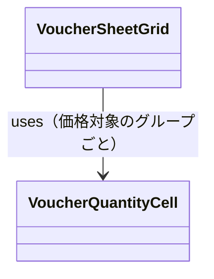

# VoucherQuantityCell（voucher_quantity_cell.dart）

| 新規作成・更新日 | 作成・更新者名 | 作成・更新内容 |
|---|---|---|
| 2026-10-03 | minamiyama | 新規作成。個数セルを同額の列のグループにつき1つにするため、[VoucherCellField](./voucher_cell_field.md)から増減ボタン（スピンボタン）の表示を分離 |

## 概要

伝票入力画面（[VoucherSheetPage](../pages/voucher_sheet_page.md)、`MMM_001_VOUCHER`）のグリッド（[VoucherSheetGrid](./voucher_sheet_grid.md)）内で、同額の列のグループ（[header_grouping](../../domain/usecases/header_grouping.md)）1つ分の個数セルを表すウィジェット。個数を中央に、左右に「-」「＋」の増減ボタン（スピンボタン）を表示する。どの列の個数を増減するかは呼び出し元（[VoucherSheetGrid](./voucher_sheet_grid.md)）が決める。画面内でのみ使用する。

## 依存関係シーケンス図

## 項目一覧（コンストラクタ引数）

| 項目論理名 | 項目物理名 | カプセルの型 | データ型 | バリデーション | 備考 |
|---|---|---|---|---|---|
| 個数 | quantity | - | int | 必須, 0以上 | グループ内の各列の個数の合計 |
| 「＋」押下時コールバック | onIncrement | - | function() -> void | 必須 | - |
| 「-」押下時コールバック | onDecrement | optional | function() -> void | 任意 | `null`の場合（個数が0）は「-」ボタンを無効化する |

## 表示ルール

- `quantity`を中央に、左右に「-」「＋」ボタンを表示する。
- 96px幅のセルにも収まるよう、ボタンは`IconButton`ではなく18px四方の固定サイズの`InkWell`で実装する。
- `onDecrement`が`null`の場合、「-」ボタンを`disabledColor`で表示し、押下を受け付けない。
