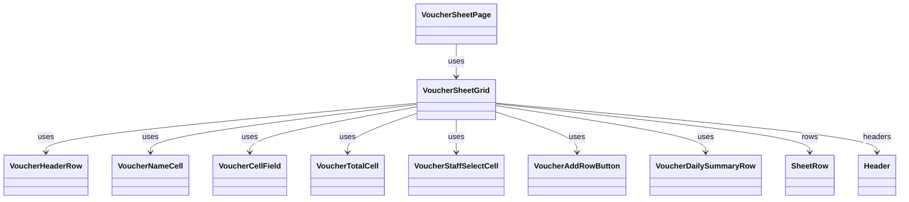

# VoucherSheetGrid（voucher_sheet_grid.dart）

| 新規作成・更新日 | 作成・更新者名 | 作成・更新内容 |
|---|---|---|
| 2026-09-29 | minamiyama | 新規作成。[docs/ui/wireframe](../../../../../../../ui/wireframe/app.js)（`table.sheet`の`position: sticky`によるヘッダー行/本日の合計行/お名前列/合計金額列/担当列の固定表示）を正として、旧`VoucherSheetPage`内のスクロール実装（縦横とも単純な`SingleChildScrollView`のネストのみで固定表示なし）を置き換え。旧`VoucherDataRow`を廃止し、[VoucherNameCell](./voucher_name_cell.md)・[VoucherTotalCell](./voucher_total_cell.md)・[VoucherStaffSelectCell](./voucher_staff_select_cell.md)に分割 |
| 2026-09-29 | minamiyama | 「合計金額」列の金額・決済方法別内訳（[VoucherDailySummaryRow](./voucher_daily_summary_row.md)）が折り返して下に回り込んでいたのを修正するため、列幅を96pxから140pxへ拡張。あわせて本日の合計行における「合計金額」列セルの右罫線を削除 |
| 2026-09-29 | minamiyama | MEMO列の入力量に応じて行の高さが本来の必要高さ（[_rowHeight]、「合計金額」列の高さと同一）より大きくなる場合に、その行全体（お名前・各価格列・MEMO・合計金額・担当）の高さを統一する`_computeRowHeights`を追加。あわせて、価格列（スピンボタン）・「合計金額」・「担当」セルが行の高さ拡大に追従せず上詰めになっていた不具合を修正（`_verticalCenter`により、幅は保ったまま縦方向のみ中央揃えするよう変更） |

## 概要

伝票入力画面（[VoucherSheetPage](../pages/voucher_sheet_page.md)、`MMM_001_VOUCHER`）の表本体を、縦・横スクロール可能なグリッドとして表示するウィジェット。紙伝票のヘッダー行固定表示（FR-1）を再現するため、以下を固定表示（sticky）する。

- 「お名前」列: 横スクロールしても常に左端に表示する。
- 「合計金額」列・「担当」列: 横スクロールしても常に右端に表示する。
- ヘッダー行（[VoucherHeaderRow](./voucher_header_row.md)＋「お名前」「合計金額」「担当」の各見出し）: 縦スクロールしても常に画面上部に表示する。
- 本日の合計行（[VoucherDailySummaryRow](./voucher_daily_summary_row.md)＋「本日の合計」見出し）: 縦スクロールしても常に画面下部に表示する。

「行を追加」ボタン（[VoucherAddRowButton](./voucher_add_row_button.md)）は「お名前」列と同じ固定領域内に配置することで、縦方向は通常の行として流れる一方、横方向は価格列のスクロール位置に関わらず常に視認できるようにする。画面内でのみ使用する。

## 依存関係シーケンス図

## 項目一覧（コンストラクタ引数）

| 項目論理名 | 項目物理名 | カプセルの型 | データ型 | バリデーション | 備考 |
|---|---|---|---|---|---|
| 列一覧 | headers | list | [Header](../../domain/entities/header.md) | 必須 | `displayOrder`昇順。`sheetDetail.headers`をそのまま渡す |
| 列ID別の現在の適用単価Map | unitPricesByColumnId | map | string(key), int(value) | 必須 | `sheetDetail.unitPricesByColumnId`をそのまま渡す |
| 行一覧 | rows | list | [SheetRow](../../domain/entities/sheet_row.md) | 必須 | `rowOrder`昇順。`sheetDetail.rows`をそのまま渡す |
| 行ID・列ID別セルMap | cellsByRowIdAndColumnId | map | string(key), map(value) | 必須 | `sheetDetail.cellsByRowIdAndColumnId`をそのまま渡す |
| スタッフ選択肢一覧 | staffRoster | list | [Staff](../../domain/entities/staff.md) | 必須 | 「担当」列プルダウンの選択肢。`sheetDetail.staffRoster`をそのまま渡す |
| 顧客ID別顧客Map | customersById | map | string(key), [Customer](../../domain/entities/customer.md)(value) | 必須 | 「お名前」列の氏名表示用。`sheetDetail.customersById`をそのまま渡す |
| 日次集計 | dailySummary | - | [DailyPaymentSummary](../../domain/entities/daily_payment_summary.md) | 必須 | `sheetDetail.dailySummary`をそのまま渡す |
| 編集中の行ID | editingRowId | optional | string | 任意 | [VoucherSheetState.editingRowId](../controllers/voucher_sheet_state.md)をそのまま渡す |
| 編集中の列ID | editingColumnId | optional | string | 任意 | [VoucherSheetState.editingColumnId](../controllers/voucher_sheet_state.md)をそのまま渡す。「お名前」列編集中の場合は特別な値`'customerName'` |
| 編集中の入力テキスト | editingText | optional | string | 任意 | [VoucherSheetState.editingText](../controllers/voucher_sheet_state.md)をそのまま渡す |
| セルタップ時コールバック | onCellTap | - | function(rowId: string, columnId: string, initialText: string) -> void | 必須 | [VoucherSheetNotifier.startEditingCell](../controllers/voucher_sheet_notifier.md#starteditingcell)をそのまま渡す |
| テキスト変更時コールバック | onTextChanged | - | function(text: string) -> void | 必須 | [VoucherSheetNotifier.updateEditingText](../controllers/voucher_sheet_notifier.md#updateeditingtext)をそのまま渡す |
| 入力確定時コールバック | onCommit | - | function() -> void | 必須 | [VoucherSheetNotifier.commitCell](../controllers/voucher_sheet_notifier.md#commitcell)をそのまま渡す |
| 担当変更時コールバック | onStaffChanged | - | function(rowId: string, staffId: string?) -> void | 必須 | [VoucherSheetNotifier.setRowStaff](../controllers/voucher_sheet_notifier.md#setrowstaff)をそのまま渡す |
| 決済方法変更時コールバック | onPaymentMethodChanged | - | function(rowId: string, method: PaymentMethod?) -> void | 必須 | [VoucherSheetNotifier.setRowPaymentMethod](../controllers/voucher_sheet_notifier.md#setrowpaymentmethod)をそのまま渡す |
| 「行を追加」ボタンタップ時コールバック | onAddRow | - | function() -> void | 必須 | [VoucherSheetNotifier.addRow](../controllers/voucher_sheet_notifier.md#addrow)をそのまま渡す |

## レイアウト設計

Flutterには表組みの一部の行・列のみを固定表示するCSSの`position: sticky`に相当する標準ウィジェットがないため、画面を「お名前」列（左固定）・価格列＋MEMO列（横スクロール領域）・「合計金額」列＋「担当」列（右固定）の3領域に横方向に分割し、それぞれの領域を独立した`SingleChildScrollView`として実装した上で、以下2グループの`ScrollController`を相互に同期させることで固定表示を実現する。

- 縦方向: 左固定領域・横スクロール領域・右固定領域の3つの`ScrollController`を同期し、いずれか1つをドラッグしても3領域が同じ量だけ縦スクロールする。ヘッダー行・本日の合計行は各領域の`Column`の外側（`Expanded`の外）に配置し、縦スクロールの対象外とすることで常に画面上部・下部に固定表示する。
- 横方向: ヘッダー行・データ行本体・本日の合計行（いずれも価格列＋MEMO列の部分のみ）の3つの`ScrollController`を同期し、いずれか1つをドラッグしても3領域が同じ量だけ横スクロールする。「お名前」列・「合計金額」列・「担当」列は左右の固定領域に属するため、この横スクロールの影響を受けない。

同期処理は非公開クラス`_LinkedScrollControllers`が担う。相互参照による無限ループを避けるため、同期処理中であることを示すフラグ（`_isSyncing`）を用いて、あるコントローラーの変更が他のコントローラーへ伝播している間は再帰的な同期処理を行わない。

## 行の高さ

データ行の高さは、3領域（お名前列・価格列＋MEMO列・合計金額列＋担当列）で常に統一する必要があるため、`_computeRowHeights`が行ごとの高さを一括算出し、3領域それぞれの行描画（`for (int i = 0; i < widget.rows.length; i++) ...`）へ共通で渡す。

- ミニマムは「合計金額」列の高さ（`_rowHeight`）とする。
- MEMO列（`isPriced=false`の列）に入力がある場合、`TextPainter`でその内容を列幅（`_priceColWidth`）に合わせて折り返した際の必要高さを算出し、`_rowHeight`を上回る場合はその値を採用する。
- 算出した高さは、お名前セル・価格セル（スピンボタン）・MEMOセル・合計金額セル・担当セルのすべてに同一の値を適用する。
- 価格セル（スピンボタン）・合計金額セル・担当セルは、行の高さがミニマムより大きくなった場合でも内容物のサイズを保ったまま縦方向中央に表示する必要があるため、`_verticalCenter`（`Column`の`mainAxisAlignment.center`＋`crossAxisAlignment.stretch`）でラップする。横幅は`crossAxisAlignment.stretch`により維持されるため、「担当」プルダウンの`isExpanded`や「合計金額」の右揃えレイアウトは崩れない（`Container`の`alignment`プロパティで中央揃えすると横方向も内容物の自然幅に縮んでしまうため使用しない）。

## 「行を追加」ボタンの配置

[VoucherAddRowButton](./voucher_add_row_button.md)は、データ行一覧の最後の要素として「お名前」列の固定領域内（左固定領域の`Column`）に配置する。価格列＋MEMO列の横スクロール領域・右固定領域には、行の高さを揃えるための同じ高さの空欄（罫線のみ）を同じ順序で配置する。
