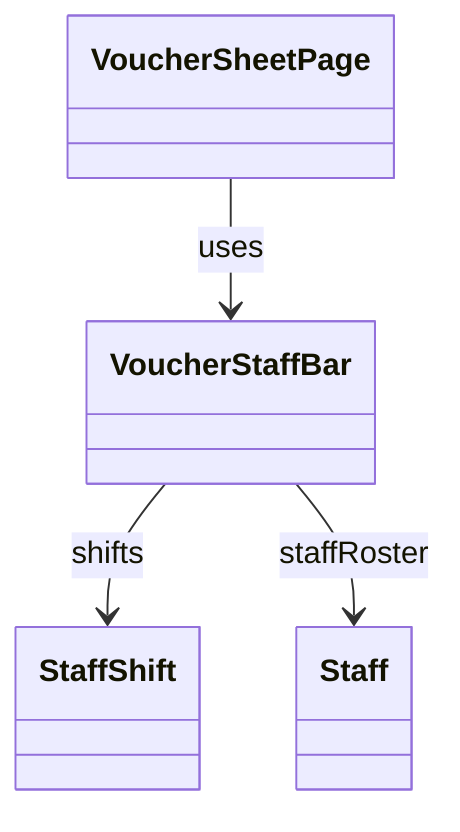

# VoucherStaffBar（voucher_staff_bar.dart）

| 新規作成・更新日 | 作成・更新者名 | 作成・更新内容 |
|---|---|---|
| 2026-09-27 | minamiyama | 新規作成（[agents.md](../../../../../../../requried/agents.md)のスタッフ欄仕様を反映） |
| 2026-09-28 | minamiyama | 就業時刻ボタンの現在時刻表示（`TimeOfDay.format`）が、ウィジェット自身の`BuildContext`ではなく`MediaQuery`祖先を持たないルート要素を参照しており実機/シミュレータ上で例外が発生していたバグを修正。ビルドメソッドに渡された`context`を内部の`_buildEntry`・`_timeButton`ヘルパーまで引き回すよう変更（表示仕様自体に変更はない） |
| 2026-09-29 | minamiyama | 担当スタッフ（`shift.staffId`）が未定のシフト枠は、出退勤時刻ボタンを空白表示・編集不可に変更（[docs/ui/wireframe](../../../../../../../ui/wireframe/app.js)に合わせて反映） |
| 2026-09-29 | minamiyama | [docs/ui/wireframe](../../../../../../../ui/wireframe/style.css)の`.staffbar__entry`を正として、シフトごとの各エントリを角丸の点線枠（`CustomPainter`による自前描画）で囲むよう変更 |
| 2026-10-03 | minamiyama | 時刻入力欄がEnter（キーボードの完了）でしか確定されず、欄の外をタップすると未保存のまま現在時刻表示に戻っていた不具合を修正。入力欄を`_StaffTimeField`として切り出し、欄の外のタップ・フォーカス喪失でも確定するよう変更（[docs/ui/wireframe](../../../../../../../ui/wireframe/app.js)の`change`・`blur`での確定に合わせる）。現在時刻の表示を端末の12/24時間表記設定に依存しない[formatHHmm](../../../../core/utils/time_format.md#formathhmm)に変更し、`_timeButton`への`context`の引き回しを廃止 |
| 2026-10-03 | minamiyama | ドリンクバック入力欄がEnterでしか確定されず、再描画のたびに入力欄が作り直されていた不具合を修正。`_DrinkBackField`として切り出し、自由記述（string型）のまま、欄の外のタップ・フォーカス喪失でも変更がある場合に確定するよう変更 |

## 概要

伝票入力画面（[VoucherSheetPage](../pages/voucher_sheet_page.md)、`MMM_001_VOUCHER`）右上の「スタッフ」欄（[StaffShift](../../domain/entities/staff_shift.md)、通常3件）を表示するウィジェット。タイトルヘッダー（AppBar）と表のヘッダー（[VoucherHeaderRow](./voucher_header_row.md)）の間に、`status=success`の間は常時表示する（`Scaffold`の`body`ではなく、AppBarと表本体の間に配置した専用の帯として実装する）。シフトごとに、氏名プルダウン・就業開始/終了時刻ボタン・「D」ラベル・ドリンクバック入力欄を横並びに配置する。氏名（担当スタッフ）が未定の間は就業開始/終了時刻ボタンを空白・編集不可とし、氏名選択後は未入力時に現在時刻を初期値として表示する（画面内でのみ使用する）。

## 依存関係シーケンス図

## 項目一覧（コンストラクタ引数）

| 項目論理名 | 項目物理名 | カプセルの型 | データ型 | バリデーション | 備考 |
|---|---|---|---|---|---|
| シフト一覧 | shifts | list | [StaffShift](../../domain/entities/staff_shift.md) | 必須 | `sheetDetail.staffShifts`をそのまま渡す。通常3件 |
| スタッフ選択肢一覧 | staffRoster | list | [Staff](../../domain/entities/staff.md) | 必須 | 氏名プルダウンの選択肢。`sheetDetail.staffRoster`をそのまま渡す |
| 編集中のシフトID | editingStaffShiftId | optional | string | 任意 | [VoucherSheetState.editingStaffShiftId](../controllers/voucher_sheet_state.md)をそのまま渡す |
| 編集中のシフト項目 | editingStaffShiftField | optional | string | 任意 | [VoucherSheetState.editingStaffShiftField](../controllers/voucher_sheet_state.md)をそのまま渡す |
| 氏名選択時コールバック | onNameChanged | - | function(shiftId: string, staffId: string?) -> void | 必須 | [VoucherSheetNotifier.setStaffShiftName](../controllers/voucher_sheet_notifier.md#setstaffshiftname)を呼び出す |
| 時刻ボタンタップ時コールバック | onTimeTap | - | function(shiftId: string, field: string) -> void | 必須 | [VoucherSheetNotifier.startEditingStaffShiftTime](../controllers/voucher_sheet_notifier.md#starteditingstaffshifttime)を呼び出す |
| 時刻確定時コールバック | onTimeCommit | - | function(value: string) -> void | 必須 | [VoucherSheetNotifier.commitStaffShiftTime](../controllers/voucher_sheet_notifier.md#commitstaffshifttime)を呼び出す |
| ドリンクバック確定時コールバック | onDrinkBackCommit | - | function(shiftId: string, text: string) -> void | 必須 | [VoucherSheetNotifier.setStaffShiftDrinkBack](../controllers/voucher_sheet_notifier.md#setstaffshiftdrinkback)を呼び出す |

## 表示ルール

- 担当スタッフ（`shift.staffId`）が未定（`null`）の場合、就業開始/終了時刻ボタンは空白表示とし、タップによる編集を受け付けない（氏名選択後に初めて時刻の入力・修正が可能になる）。
- 担当スタッフが選択済みの場合、就業開始/終了時刻ボタンは`shift.startTime`/`shift.endTime`が`null`のとき現在時刻（`HH:mm`）を表示する（保存値ではなく表示上の初期値。値を確定するまでDBには反映しない）。
- `editingStaffShiftId`が対象シフトの`shiftId`と一致し、かつ`editingStaffShiftField`が対象項目と一致する場合のみ、ボタンの代わりに時刻入力欄（`_StaffTimeField`）を表示する。入力欄の初期値はボタンの表示値（保存値、未入力時は現在時刻）とする。
- 時刻入力欄は、Enter（キーボードの完了）・欄の外のタップ・フォーカス喪失のいずれかで、入力欄の値を`onTimeCommit`に渡して確定する（1回の編集につき確定は1回のみ）。
- ドリンクバック入力欄（`_DrinkBackField`）は自由記述（string型）として入力値をそのまま扱う（形式チェック・変換は行わない）。Enter・欄の外のタップ・フォーカス喪失のいずれかで、`shift.drinkBack`（保存済みの値、未入力時は空文字列）から変更がある場合のみ`onDrinkBackCommit`に渡して確定する。入力中でない間に保存済みの値が変化した場合（再読込など）は入力欄に反映する。シフトごとに`shiftId`をキーとして入力欄を区別する。
- 横スクロールが発生する画面幅でも欄全体が視認できるよう、内部を横スクロール可能なコンテナとして実装する。
- シフトごとのエントリ（氏名プルダウン〜ドリンクバック入力欄）は、角丸・点線（`colorScheme.outlineVariant`）の枠で囲む。
