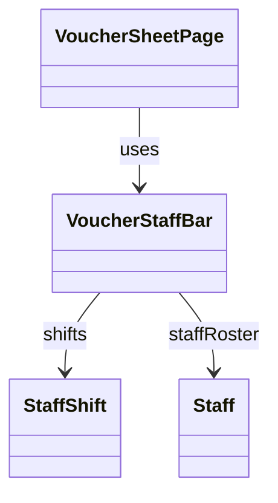

# VoucherStaffBar（voucher_staff_bar.dart）

| 新規作成・更新日 | 作成・更新者名 | 作成・更新内容 |
|---|---|---|
| 2026-09-27 | minamiyama | 新規作成（[agents.md](../../../../../../../requried/agents.md)のスタッフ欄仕様を反映） |

## 概要

伝票入力画面（[VoucherSheetPage](../pages/voucher_sheet_page.md)、`MMM_001_VOUCHER`）右上の「スタッフ」欄（[StaffShift](../../domain/entities/staff_shift.md)、通常3件）を表示するウィジェット。タイトルヘッダー（AppBar）と表のヘッダー（[VoucherHeaderRow](./voucher_header_row.md)）の間に、`status=success`の間は常時表示する（`Scaffold`の`body`ではなく、AppBarと表本体の間に配置した専用の帯として実装する）。シフトごとに、氏名プルダウン・就業開始/終了時刻ボタン・「D」ラベル・ドリンクバック入力欄を横並びに配置する。就業時刻ボタンは未入力時、現在時刻を初期値として表示する（画面内でのみ使用する）。

## 依存関係シーケンス図

## 項目一覧（コンストラクタ引数）

| 項目論理名 | 項目物理名 | カプセルの型 | データ型 | バリデーション | 備考 |
|---|---|---|---|---|---|
| シフト一覧 | shifts | list | [StaffShift](../../domain/entities/staff_shift.md) | 必須 | `sheetDetail.staffShifts`をそのまま渡す。通常3件 |
| スタッフ選択肢一覧 | staffRoster | list | [Staff](../../domain/entities/staff.md) | 必須 | 氏名プルダウンの選択肢。`sheetDetail.staffRoster`をそのまま渡す |
| 編集中のシフトID | editingStaffShiftId | optional | string | 任意 | [VoucherSheetState.editingStaffShiftId](../controllers/voucher_sheet_state.md)をそのまま渡す |
| 編集中のシフト項目 | editingStaffShiftField | optional | string | 任意 | [VoucherSheetState.editingStaffShiftField](../controllers/voucher_sheet_state.md)をそのまま渡す |
| 氏名選択時コールバック | onNameChanged | - | function(shiftId: string, staffId: string?) -> void | 必須 | [VoucherSheetNotifier.setStaffShiftName](../controllers/voucher_sheet_notifier.md#setstaffshiftname)を呼び出す |
| 時刻ボタンタップ時コールバック | onTimeTap | - | function(shiftId: string, field: string) -> void | 必須 | [VoucherSheetNotifier.startEditingStaffShiftTime](../controllers/voucher_sheet_notifier.md#starteditingstaffshifttime)を呼び出す |
| 時刻確定時コールバック | onTimeCommit | - | function(value: string) -> void | 必須 | [VoucherSheetNotifier.commitStaffShiftTime](../controllers/voucher_sheet_notifier.md#commitstaffshifttime)を呼び出す |
| ドリンクバック確定時コールバック | onDrinkBackCommit | - | function(shiftId: string, text: string) -> void | 必須 | [VoucherSheetNotifier.setStaffShiftDrinkBack](../controllers/voucher_sheet_notifier.md#setstaffshiftdrinkback)を呼び出す |

## 表示ルール

- 就業開始/終了時刻ボタンは、`shift.startTime`/`shift.endTime`が`null`の場合、現在時刻（`HH:mm`）を表示する（保存値ではなく表示上の初期値。値を確定するまでDBには反映しない）。
- `editingStaffShiftId`が対象シフトの`shiftId`と一致し、かつ`editingStaffShiftField`が対象項目と一致する場合のみ、ボタンの代わりに時刻入力欄を表示する。
- 横スクロールが発生する画面幅でも欄全体が視認できるよう、内部を横スクロール可能なコンテナとして実装する。
