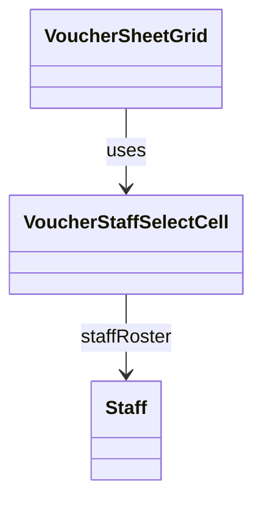

# VoucherStaffSelectCell（voucher_staff_select_cell.dart）

| 新規作成・更新日 | 作成・更新者名 | 作成・更新内容 |
|---|---|---|
| 2026-09-29 | minamiyama | 新規作成。[VoucherSheetGrid](./voucher_sheet_grid.md)の「担当」列固定表示対応に伴い、旧`VoucherDataRow`から「担当」セルの表示ロジックを分離 |
| 2026-10-03 | minamiyama | 論理削除済みのスタッフが担当の場合、プルダウンの値が選択肢に存在せず例外となるため、「未定」として表示するよう変更 |

## 概要

伝票入力画面（[VoucherSheetPage](../pages/voucher_sheet_page.md)、`MMM_001_VOUCHER`）のグリッド内で1行分の「担当」列セルを表すウィジェット。[VoucherSheetGrid](./voucher_sheet_grid.md)の右端固定列（横スクロールしても常に視認できる領域）で、行数分繰り返し使用する。会計を行ったスタッフをプルダウンで選択する（決済方法「P」「カ」とは別概念）。画面内でのみ使用する。

## 依存関係シーケンス図

## 項目一覧（コンストラクタ引数）

| 項目論理名 | 項目物理名 | カプセルの型 | データ型 | バリデーション | 備考 |
|---|---|---|---|---|---|
| 選択中のスタッフID | staffId | optional | string | 任意 | `row.staffId`をそのまま渡す。`null`は「未定」 |
| スタッフ選択肢一覧 | staffRoster | list | [Staff](../../domain/entities/staff.md) | 必須 | `sheetDetail.staffRoster`をそのまま渡す |
| 選択変更時コールバック | onChanged | - | function(staffId: string?) -> void | 必須 | [VoucherSheetNotifier.setRowStaff](../controllers/voucher_sheet_notifier.md#setrowstaff)を呼び出す |

## 表示ルール

- `staffRoster`から選択するプルダウンとして表示する。`staffId`が`null`の場合は「未定」を選択状態とする。
- `staffId`が`staffRoster`に含まれない場合（論理削除済みのスタッフ）も「未定」を選択状態として表示する（保存値は変更しない）。削除済みスタッフはプルダウンの選択肢に含めない。
