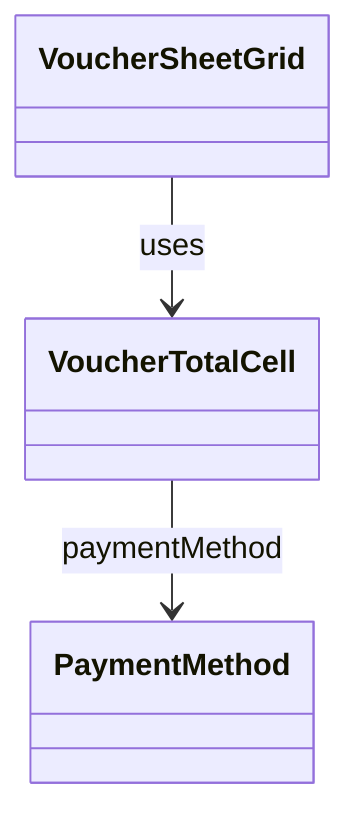

# VoucherTotalCell（voucher_total_cell.dart）

| 新規作成・更新日 | 作成・更新者名 | 作成・更新内容 |
|---|---|---|
| 2026-09-29 | minamiyama | 新規作成。[VoucherSheetGrid](./voucher_sheet_grid.md)の「合計金額」列固定表示対応に伴い、旧`VoucherDataRow`から「合計金額」セルの表示ロジックを分離 |
| 2026-09-29 | minamiyama | 金額表示を[currency_format](../../../../core/utils/currency_format.md)の`formatYen`による3桁区切りカンマ付き表示に変更 |

## 概要

伝票入力画面（[VoucherSheetPage](../pages/voucher_sheet_page.md)、`MMM_001_VOUCHER`）のグリッド内で1行分の「合計金額」列セルを表すウィジェット。[VoucherSheetGrid](./voucher_sheet_grid.md)の右端固定列（横スクロールしても常に視認できる領域）で、行数分繰り返し使用する。金額と決済方法（PayPay／カード）のトグルボタンを表示する。画面内でのみ使用する。

## 依存関係シーケンス図

## 項目一覧（コンストラクタ引数）

| 項目論理名 | 項目物理名 | カプセルの型 | データ型 | バリデーション | 備考 |
|---|---|---|---|---|---|
| 合計金額 | amount | - | int | 必須 | `row.totalAmount`をそのまま渡す |
| 決済方法 | paymentMethod | optional | [PaymentMethod](../../domain/entities/enums/payment_method.md) | 任意 | `row.paymentMethod`をそのまま渡す。`null`は現金決済 |
| 決済方法変更時コールバック | onPaymentMethodChanged | - | function(method: PaymentMethod?) -> void | 必須 | [VoucherSheetNotifier.setRowPaymentMethod](../controllers/voucher_sheet_notifier.md#setrowpaymentmethod)を呼び出す。タップした決済方法が既に選択中の場合は`null`（現金）を渡す |

## 表示ルール

- `amount`を太字で表示する。
- その隣に「P」「カ」の2つの決済方法トグルボタンを配置する。`paymentMethod`が該当する値と一致する場合は選択中（塗りつぶし）の見た目にする。どちらも選択中でない場合は現金決済を意味する。
